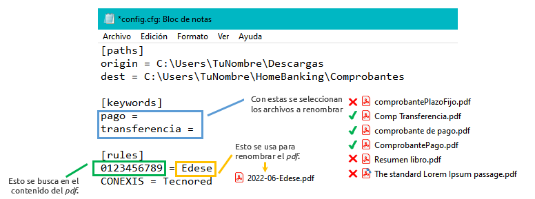

# ordenamelo

**¡Una app cli para renombrar y mover esos odiosos comprobantes de pago mensuales!**


*Read this in other languages:* [*README.en*](README.md) 

## ¿Qué es?

Si haces *muchos* pagos por home banking y te gusta guardar los comprobantes de manera ordenada pero *no quieres* hacerlo a mano, ¡esta es tu solución!

Con `ordenamelo` puedes renombrar los archivos *pdf* de comprobantes de pago o transferencias con un solo comando. 
Opcionalmente, se pueden mover a una carpeta pre-definida.

## Instalación

> ⚠️ *Por el momento, `ordenamelo` solo se puede instalar como un paquete Python, es decir, tienes que tener Python y pip instalado en tu sistema.*   

1. Descargar `.whl` de la carpeta `dist/` de este repo.
2. En una terminal ejecutar: 

- OS X & Linux:

```shell
python3 -m pip install nombre_del_wheel_.whl
```
   
- Windows:

```shell
py -m pip install nombre_del_wheel.whl 
```

## Como usar

La primera vez que lo uses, vas a tener que configurar tus carpetas, palabras clave y reglas.

> ⚠️ *Actualmente, `ordenamelo` solo funciona con comprobantes de los bancos Nación y Santander de Argentina.* 

### 1. Configurar

```shell
ordenamelo --config 
```



- Sección `paths`:
  - `origin` carpeta donde buscar los comprobantes. Usualmente será *descargas*.
  - `dest` carpeta a donde mover los comprobantes. Tener en cuenta que dentro de esta carpeta:
    - se crea una carpeta por año para guardar los comprobantes
    - se crea una carpeta `transferencias` dentro de la anual para guardar los comprobantes de transferencias

- Sección `keywords`:
  - Se deben incluir las palabras que identifican a los archivos. Usualmente `pago` y `transferencia` son suficientes.
  - Deben ir una por línea y con signo = al final.

- Sección `rules`: contiene las reglas para renombrar los archivos.
  - El formato general del nombre es AÑO-MES-textoDerechaRule.pdf
    - El año y el mes se toman automáticamente el día del pago (cuando se genera el pdf del comprobante).
    - Las claves (texto a la izquierda) deben identificar de forma única ese tipo de comprobante, por ejemplo, número de cliente o de cuenta.

### 2. Usar

Para renombrar y mover todos los archivos que se encuentran:

```shell
ordenamelo 
```

Solo renombrar, sin mover:

```shell
ordenamelo -ro
```

Mientras se ejecuta se imprimen mensajes indicando los archivos, encontrados, renombrados, movidos, etc.


## Licencia

Este proyecto se distribuye bajo los términos de la licencia `Apache`.
Puedes ver la licencia completa [aquí](LICENSE).

## Hecho con

Este proyecto se desarrolló con `python`:
- `argparse` para procesar las opciones de linea de comandos.
- `pathlib` para gestionar con archivos y carpetas.
- `pdfplumber`, una *lib de 3ros*, para acceder a los metadatos y contenido de los archivos *pdf*.

## Release History

* 0.1.1
    * Minor style refactoring

* 0.1.0
    * First release

## Feedback

¡Todo comentario y sugerencia es bienvenido! Puedes contactarme a través de [`twitter`](https://twitter.com/GargaraG) o [`linkedin`](https://www.linkedin.com/in/gonzalezgbr/). 

Gracias por visitar este proyecto ♥

---

**By GG** · [`github` @gonzalezgbr](https://github.com/gonzalezgbr/) · [`linkedin` @gonzalezgbr](https://www.linkedin.com/in/gonzalezgbr/) · [`twitter` @GargaraG](https://twitter.com/GargaraG) 
