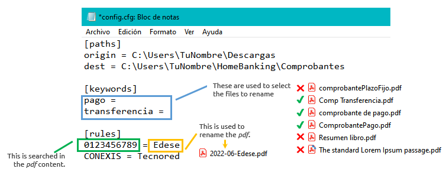

# ordenamelo (tidy up)

**A cli app to rename and move those awful monthly payment receipts!**


*Read this in other languages:* [*README.es*](README.es.md) 

## What is it?

If you usually make *a lot* of payments through home banking and like to save the receipts in an orderly fashion, but *really* hate to do it by hand, this is your solution!

With `ordenamelo` you can rename the *pdf* files for payment or transfer receipts using a single command. They can also, optionally, be moved to a pre-defined folder. 

## Installation

> ⚠️ *Currently, `ordenamelo` can only be installed as a Python package, meaning you need to have Python and pip installed on your system.*   

1. Download `.whl` file from `dist/` folder in this repo.
2. Open a terminal window and execute: 

- OS X & Linux:

```shell
python3 -m pip install wheel_name.whl
```
   
- Windows:

```shell
py -m pip install wheel_name.whl 
```

## Usage

The first time to use it, you will need to configure folders, keywords and rules. 

> ⚠️ *Currently, `ordenamelo` only works with bank receipts from Banco de la Nación Argentina and Banco Santander.* 

### 1. Configure

```shell
ordenamelo --config 
```



- Section `paths`:
  - `origin` folder where to look for receipts. Usually *downloads*.
  - `dest` folder where to move the receipts after renaming them. Within this folder:
    - a yearly folder will be created, to store receipts by date 
    - a `transferencias` folder will be created, within the yearly one, to store transfer receipts 

- Section `keywords`:
  - Include the words that identify the files to rename. Usually `pago` and `transferencia` are good enough.
  - They must go one on each line and with the = sign at the end. 

- Section `rules`: contains the rules to rename the files.
  - The general naming format is AÑO-MES-textoDerechaRule.pdf
    - *año* and *mes* are automatically calculated from the payment date (the day that the pdf file is generated).
    - The *keys* (text to the left) must uniquely identify that type of receipt, for example, client or account number.

> *Don't worry, you do this configuration only once!*

### 2. Use

To rename and move all the files that match the keywords and the rules:

```shell
ordenamelo 
```

Just rename, don't move:

```shell
ordenamelo -ro
```

During execution, you will see messages indicating found files, renamesd files, moved files, and warnings. 


## License

This project is licensed under the terms of the `Apache` license.
You can check out the full license [here](LICENSE).


## Built with

This project was built with `python`:
- `argparse` to process the cli options.
- `pathlib` to deal with files and folders.
- `pdfplumber`, a *3rd party lib*, to access the pdf files metadata and content.


## Release History

* 0.1.1
    * Minor style refactoring

* 0.1.0
    * First release

## Feedback

Any feedback is greatly appreciated! You can contact me via [`twitter`](https://twitter.com/GargaraG) or [`linkedin`](https://www.linkedin.com/in/gonzalezgbr/). 

Thanks for checking out this project ♥

---

**By GG** · [`github` @gonzalezgbr](https://github.com/gonzalezgbr/) · [`linkedin` @gonzalezgbr](https://www.linkedin.com/in/gonzalezgbr/) · [`twitter` @GargaraG](https://twitter.com/GargaraG) 
